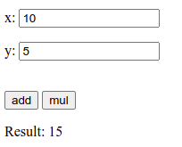

# Demo Wasm

This demo shows how to use [Emscripten](https://emscripten.org/index.html), to
compile C/C++ code into JavaScript and run that on the web. 

Emscripten is a complete compiler toolchain to WebAssembly, using LLVM, that
enables porting your C/C++ project to browsers, Node.js, or Wasm runtimes.

[WebAssembly](https://webassembly.org/) (abbreviated *Wasm*) is a binary
instruction format for a stack-based virtual machine. Wasm is designed as a
portable compilation target for programming languages, enabling deployment on
the web for client and server applications.

## Installation

For Debian/Ubuntu:

```bash
sudo apt install emscripten
```

## Demo

Let is consider a simple code [math.c](math.c) written in C, with three
functions `int_add()`, `int_mul()` and `int_sqrt()`.

### Demo Node.js

**Compilation**:

```bash
emcc math.c -o math.js -s MODULARIZE -s EXPORTED_RUNTIME_METHODS=ccall,cwrap
```

Note that both files `math.js` and `math.wasm` are generated.

**Test**: 
Lets now prepare a simple [test.js](test.js) for `Node.js` that uses this
`math.js` module:

```bash
node test.js
```

### Demo Web

**Compilation**:

```bash
emcc math.c -o math.js -s EXPORTED_RUNTIME_METHODS=ccall,cwrap
```

FIXME: how to use the option `-s MODULARIZE` instead of default `Module`?

Lets now preprare a web page [test.html](test.html) that will import the
`math.js` module.



To test this, you need to publish these files (`test.html`, `math.js` and
`math.wasm`) on your favorite web server. Then, you can open it in your favorite
browser with `http://` protocol. Warning, local access with `file://` protocol
will fail!

**Demo**: <https://aurelien-esnard.emi.u-bordeaux.fr/demo-wasm/test.html>


## Documentation

* <https://emscripten.org/docs/getting_started/Tutorial.html>
* <https://medium.com/@eliamaino/calling-c-functions-from-javascript-with-emscripten-first-part-e99fb6eedb22>
* <https://emscripten.org/docs/porting/connecting_cpp_and_javascript/Interacting-with-code.html#calling-compiled-c-functions-from-javascript-using-ccall-cwrap>
* <https://developer.mozilla.org/fr/docs/WebAssembly/C_to_wasm>
* <https://livebook.manning.com/book/webassembly-in-action/b-ccall-cwrap-and-direct-function-calls/v-7/25>

---
aurelien.esnard@u-bordeaux.fr
